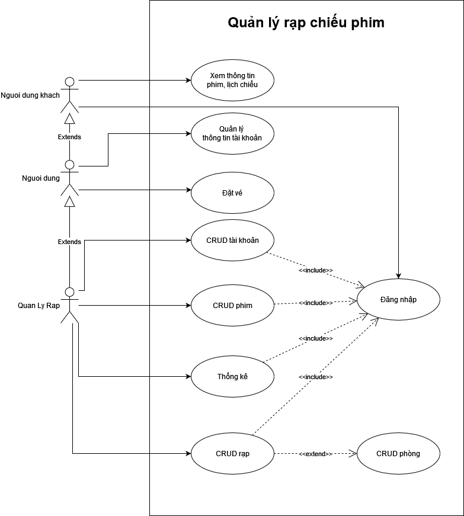
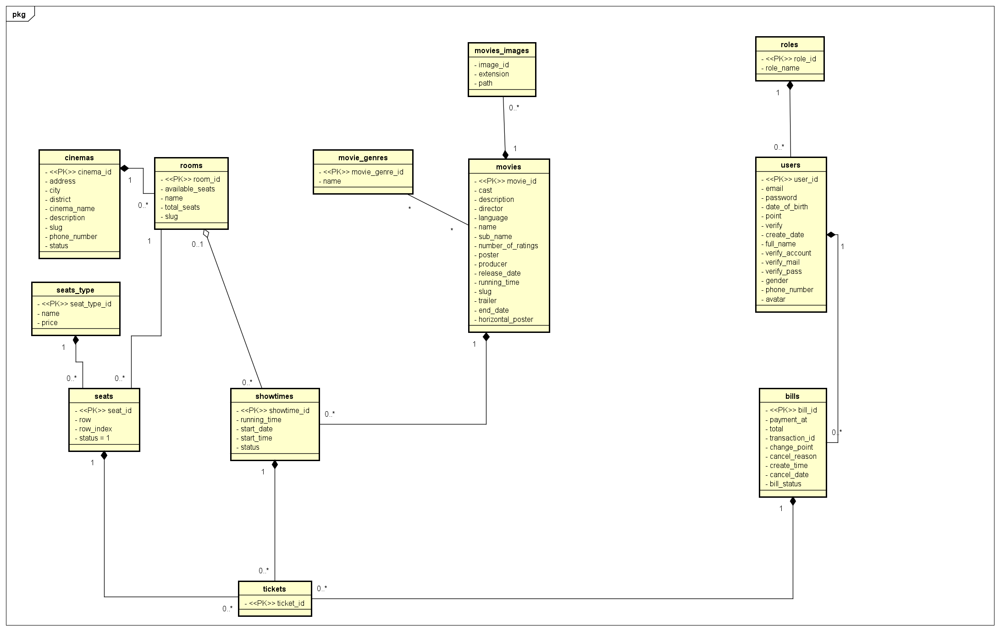
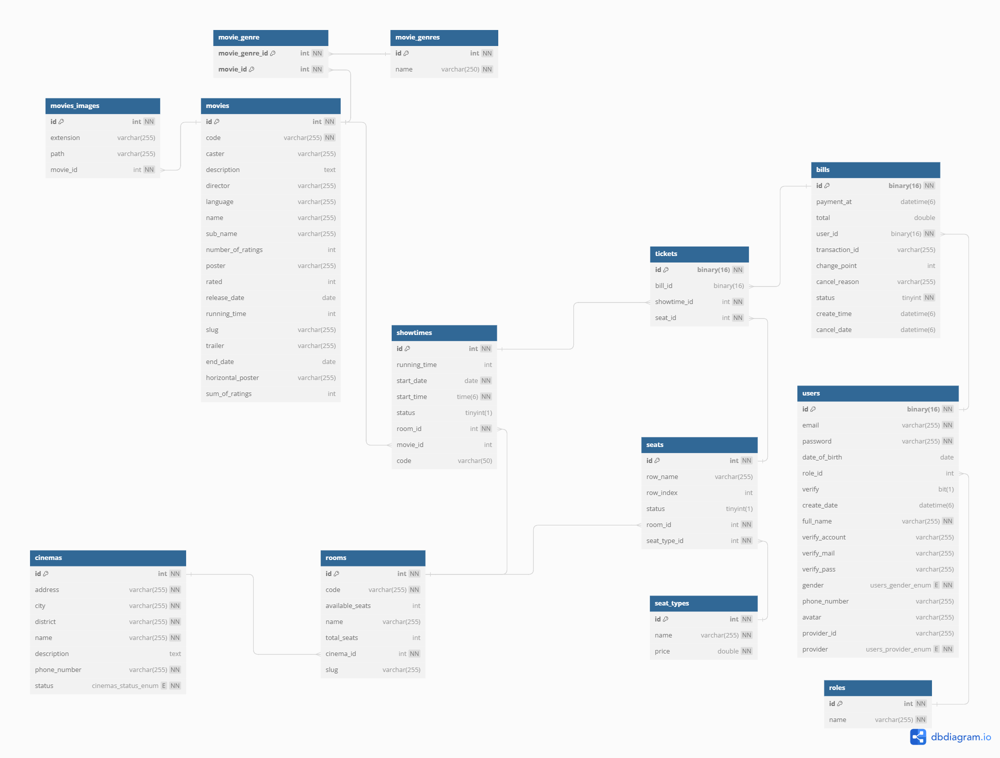

# Giới thiệu

- Trong các rạp chiếu phim hiện nay, việc quản lý và tổ chức chiếu phim luôn là vấn đề được quan tâm. Người quản lý luôn
  gặp khó khăn trong vấn đề quản lý quá trình hoạt động của từng bộ phận như: phim, lịch chiếu,… và đặc biệt là việc
  kiểm soát quá trình bán vé. Việc quản lý thường tốn nhiều thời gian và sức người vì thế làm tăng chi phí vận hành, thu
  nhập của rạp bị ảnh hưởng rất nhiều. Việc tạo ra một phần mềm quản lý rạp chiếu phim là một nhu cầu tất yếu để giải
  quyết bài toán quản lý của các nhà kinh doanh, vì thế nhóm đã chọn đề tài này.

- Hệ thống quản lý rạp chiếu phim được xây dựng dựa trên những nhu cầu thực tế của khách hàng và nhà quản lý nhằm giải
  quyết những khó khăn gặp phải, giảm thiểu rủi ro trong quá trình quản lý rạp. Hệ thống hướng tới các đối tượng là
  những nhân viên quản lý trong rạp. Hệ thống có các chức năng chính bao gồm: quản lý phim, quản lý lịch chiếu, quản lý
  rạp, quản lý vé, quản lý người dùng và quản lý thông tin khách hàng. Các chức năng này giúp người quản lý dễ dàng điều
  khiển quá trình hoạt động của rạp.

# Thiết kế hệ thống

## Quy trình nghiệp vụ

###	Lập kế hoạch và phân phối suất chiếu
- Vào cuối tháng, phòng điều hành sẽ xem xét các bộ phim sẽ chiếu trong tháng tiếp theo(cùng lúc đó xem xét thêm trong tháng tiếp theo đó có những ngày lễ gì đặc biệt không), phân phối các suất chiếu và thời gian phù hợp cho tháng đó.
- Tiếp theo, bản kế hoạch sẽ được gửi cho quản lý của các rạp chiếu phim để phòng điều hành điều chỉnh lịch chiếu sao cho phù hợp với tình trạng của từng rạp như là: số suất chiếu trong 1 ngày, số phòng chiếu phim của 1 rạp, số suất chiếu được trong 1 ngày,... và gửi sang cho phòng vé. Phòng vé cập nhật thông tin vé bán trong ngày - tuần - tháng vào hệ thống vé bán. Từ đó thống kê được doanh thu của các rạp vé

###	Mua vé trực tuyến qua website của rạp CGV

> Khách hàng khi mua vé trực tuyến tại website của rạp CGV phải đăng nhập tài khoản thành viên CGV và thực hiện các thao tác theo trình tự sau:

1. Khách hàng lựa chọn suất chiếu theo phim hoặc suất chiếu theo rạp.
2. Khách hàng lựa chọn chỗ ngồi.
3. Kiểm tra lại toàn bộ thông tin trước khi thanh toán
4. Thanh toán bằng các hình thức thanh toán online qua thẻ tín dụng (Visa,Mastercard...), thẻ ATM, ví điện tử,...
5.1. Thông báo cho khách hàng không còn suất chiếu
5.2. Khách hàng nhận mã đặt chỗ qua tin nhắn SMS và email.
6. Khách hàng cung cấp mã đặt vé và các thông tin tài khoản thành viên CGV dùng để đặt vé để nhận vé tại rạp. Nếu khách hàng không cung cấp được thông tin tài khoản CGV và mã đặt vé, CGV có quyền từ chối xuất vé.
7. Nhân viên quầy bán vé cập nhật thông tin vé đã bán lên hệ thống. Đồng thời nhân viên quầy bán vé sẽ tiến hành in vé và sau đó phát vé cho khách hàng

###	Hoàn vé khi đặt vé qua website: 
1.	Khách hàng đăng nhập thông tin tài khoản thành công vào website của CGV
2.	Sau đó, khách hàng tìm kiếm thông tin vé đã đặt của mình trên giao diện của website
3.	Tiếp theo, khách hàng có thể thấy chức năng “Hoàn vé, đổi vé” của rạp và khách hàng chỉ thực hiện được chức năng sớm hơn giờ suất chiếu đã đặt là 1 giờ 30p

## Use Case Diagram

| Mức độ ưu tiên | Xếp hạng  | Mô tả                                                                                                                   |
| -------------- | --------- | ----------------------------------------------------------------------------------------------------------------------- |
| 1              | Thiết yếu | Yêu cầu này rất quan trọng đối với sự thành công của dự án. Dự án sẽ không thể thực hiện được nếu không có yêu cầu này. |
| 2              | Tương lai | Yêu cầu này nằm ngoài phạm vi cho dự án này và đã được đưa vào đây để phát hành có thể trong tương lai.                 |

> Vì thời gian cùng nhân lực nên nhóm giới hạn lại phạm vi gồm các chức năng như sau:

|   |   |   |   |
|---|---|---|---|
|STT|Chức năng|Độ ưu tiên|Đối tượng|
|1|Đăng nhập - Đăng xuất|1|Người dùng|
|2|Đăng ký|1|Khách hàng tiềm năng|
|3|Tìm kiếm phim|1|Người dùng|
|4|Đặt vé|1|Người dùng|
|5|Quản lý tài khoản cá nhân|1|Người dùng|
|6|Thanh toán bằng VNPAY|1|Người dùng|
|7|Xác thực email bằng mã OTP|2|Người dùng|
|8|Quên mật khẩu - khôi phục mật khẩu|2|Người dùng|
|9|Quản lý phim|1|Quản trị viên|
|10|Quản lý tài khoản người dùng|1|Quản trị viên|
|11|Quản lý rạp|1|Quản trị viên|
|12|Quản lý suất chiếu|1|Quản trị viên|
|13|Duyệt bình luận|2|Quản trị viên|
|14|Thống kê|1|Quản trị viên|

Use Case Diagram Tổng quát

## Actors

### Khách 

- Là người dùng chưa đăng nhập hoặc chưa có tài khoản trong hệ thống, có thể xem thông tin, tra cứu phim, có thể xem các
  giờ chiếu,
- Phải đăng ký tài khoản để đặt vé
- Khi tài khoản được đăng ký cần phải xác thực được xác nhận thông qua email

### Khách hàng

- Là người đã có tài khoản trong hệ thống và đã xác thực email, có thể đặt vé và nhận thông tin vé mình đã mua qua email
- Có thể cập nhật thông tin tài khoản, lấy lại tài khoản khi quên mật khẩu

### Người quản lý 

- Là người quản lý các suất chiếu, tài khoản người dùng, phim, rạp, và là người biết tình hình kinh doanh tổng và từng
  chi nhánh của The Cinema
  
## Class Diagram

Class Diagram

## Database Diagram

